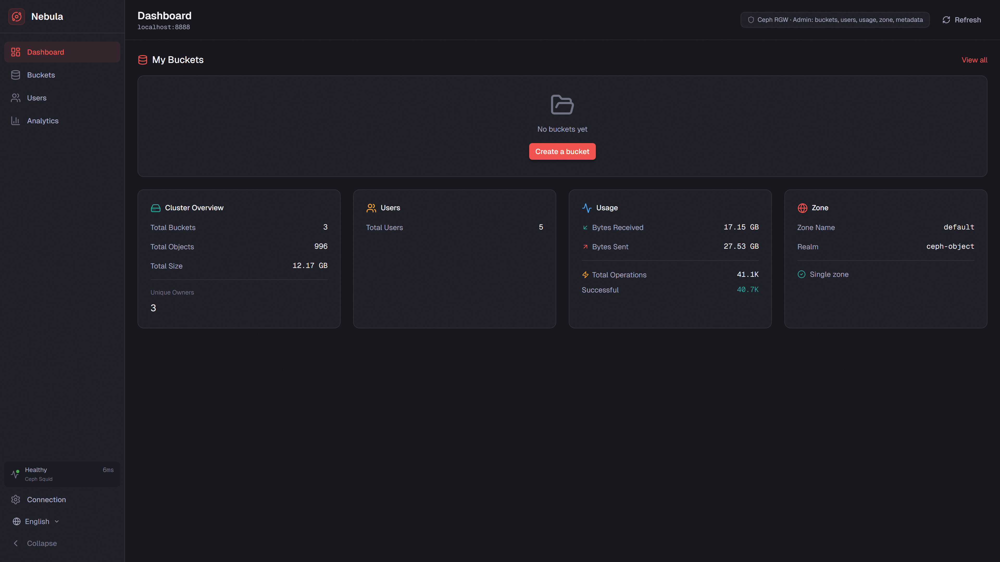
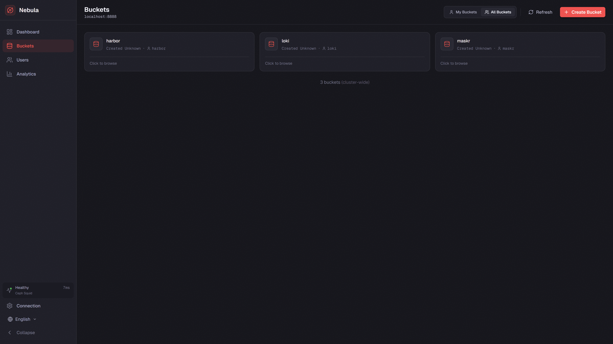
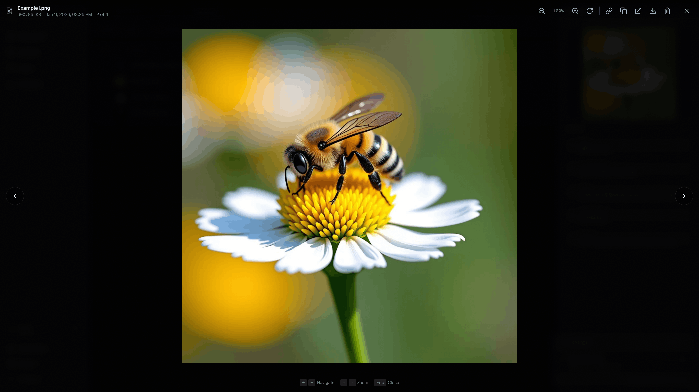
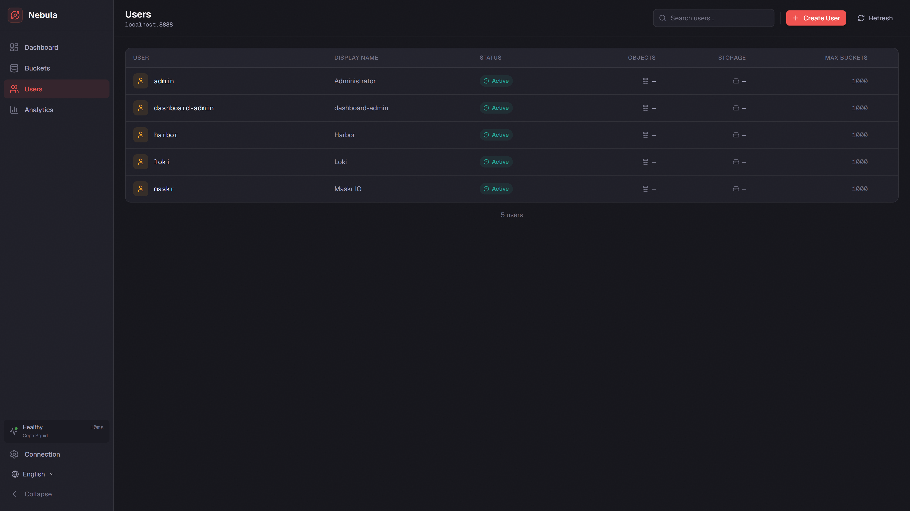
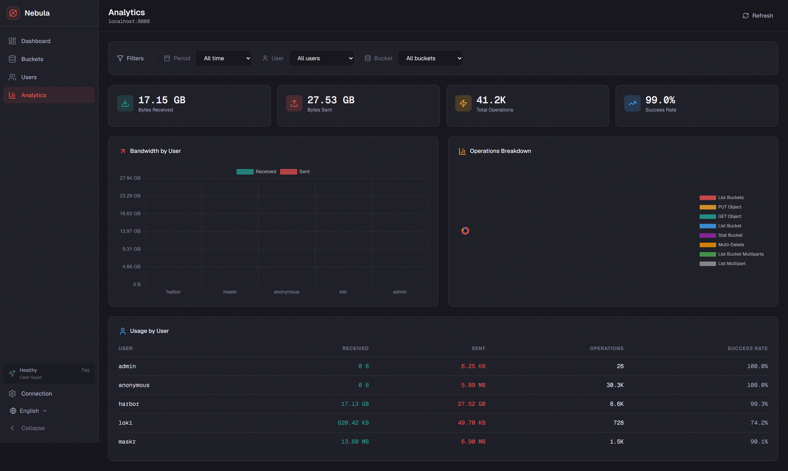
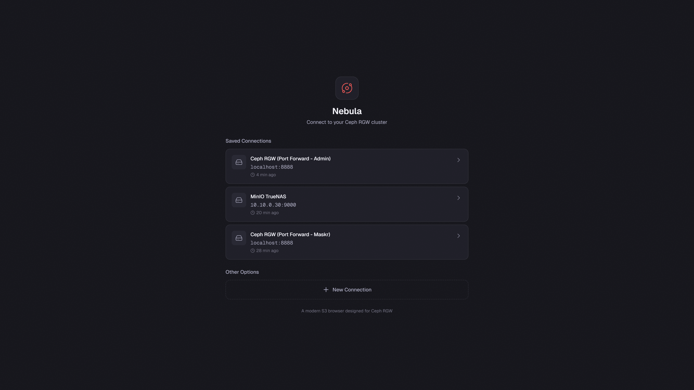

# Nebula

**The S3 browser that Ceph deserves.**

A modern, open-source admin console for Ceph RGW with full management capabilities. Also works with MinIO and any S3-compatible storage.



## ✨ Features

### Storage Management
- **Bucket Management** - Create, delete, browse buckets with a beautiful card-based UI
- **Object Browser** - Navigate folders, upload/download files, drag-and-drop support
- **File Preview** - Images, video, audio, code/text with syntax highlighting, gallery mode with navigation
- **Bucket Settings** - Versioning, lifecycle rules, encryption, policies, ACLs, tags, quotas, object locking

### Ceph RGW Admin
- **User Management** - Create, view, suspend/enable users, manage access keys
- **Quotas** - Set user and bucket quotas with size and object limits
- **Analytics** - Usage statistics, bandwidth charts, operations breakdown by user
- **Cluster Overview** - Total buckets, objects, storage used, zone information

### Enterprise-Ready
- **Multi-Connection** - Save and switch between multiple S3 endpoints
- **Proxy Mode** - Route requests through server for in-cluster Kubernetes deployments
- **Environment Presets** - Pre-configure connections via environment variables
- **Internationalization** - English and Russian included, easy to add more
- **Backend Auto-Detection** - Automatically detects Ceph RGW vs generic S3 and adjusts features

## 📸 Screenshots

<details>
<summary>Click to expand screenshots</summary>

### Dashboard


### Bucket Browser


### File Preview with Gallery Mode


### User Management


### Analytics


### Connection Manager


</details>

## 🚀 Quick Start

### Using Docker

```bash
docker run -p 3000:3000 ghcr.io/maskrdotio/nebula:latest
```

Then open http://localhost:3000 and connect to your S3 endpoint.

### Using Docker Compose

```yaml
version: '3.8'
services:
  nebula:
    image: ghcr.io/maskrdotio/nebula:latest
    ports:
      - "3000:3000"
    environment:
      # Optional: Pre-configured connections
      - NEBULA_RGW_1_NAME=Production Ceph
      - NEBULA_RGW_1_ENDPOINT=https://rgw.example.com
      - NEBULA_RGW_1_REGION=us-east-1
```

### From Source

```bash
# Clone the repository
git clone https://github.com/maskrdotio/nebula.git
cd nebula

# Install dependencies
pnpm install

# Run development server
pnpm dev

# Or build for production
pnpm build
pnpm preview
```

## ⚙️ Configuration

Nebula can be configured via environment variables to pre-define connections.

### Environment Variables

| Variable | Description | Default |
|----------|-------------|---------|
| `NEBULA_RGW_{n}_NAME` | Display name for connection | `Connection {n}` |
| `NEBULA_RGW_{n}_ENDPOINT` | S3 endpoint URL | (required) |
| `NEBULA_RGW_{n}_ACCESS_KEY` | Access key (optional, user can enter) | - |
| `NEBULA_RGW_{n}_SECRET_KEY` | Secret key (optional, user can enter) | - |
| `NEBULA_RGW_{n}_REGION` | Signing region | `us-east-1` |
| `NEBULA_RGW_{n}_PROXY` | Route through server (for k8s) | `false` |

Where `{n}` is 1, 2, 3, etc. for multiple connections.

### Example: Kubernetes In-Cluster

```yaml
env:
  - name: NEBULA_RGW_1_NAME
    value: "Ceph Object Store"
  - name: NEBULA_RGW_1_ENDPOINT
    value: "http://rook-ceph-rgw-ceph-object.rook-ceph.svc:80"
  - name: NEBULA_RGW_1_PROXY
    value: "true"
  - name: NEBULA_RGW_1_ACCESS_KEY
    valueFrom:
      secretKeyRef:
        name: rgw-admin-credentials
        key: access-key
  - name: NEBULA_RGW_1_SECRET_KEY
    valueFrom:
      secretKeyRef:
        name: rgw-admin-credentials
        key: secret-key
```

## 🔧 Requirements

### For Full Ceph RGW Features
- Ceph RGW with Admin API enabled
- User with admin capabilities (`users`, `buckets`, `usage`, `metadata`, `zone`)

### For Basic S3 Features
- Any S3-compatible endpoint (MinIO, AWS S3, Ceph RGW, etc.)
- Access key and secret key with appropriate permissions

## 🌍 Internationalization

Nebula includes translations for:
- 🇬🇧 English
- 🇷🇺 Russian

Want to add your language? See [CONTRIBUTING.md](CONTRIBUTING.md) for translation guidelines.

## 🤝 Contributing

Contributions are welcome! Please see [CONTRIBUTING.md](CONTRIBUTING.md) for guidelines.

- 🐛 Found a bug? [Open an issue](https://github.com/maskrdotio/nebula/issues)
- 💡 Have a feature idea? [Start a discussion](https://github.com/maskrdotio/nebula/discussions)
- 🌍 Want to translate? PRs welcome!

## 📄 License

[MIT](LICENSE) - Use it, modify it, ship it. No strings attached.

## 🙏 Acknowledgments

Built with:
- [Nuxt 4](https://nuxt.com/) - Vue.js framework
- [Tailwind CSS](https://tailwindcss.com/) - Styling
- [AWS SDK](https://aws.amazon.com/sdk-for-javascript/) - S3 operations
- [Shiki](https://shiki.matsu.io/) - Syntax highlighting

---

**Nebula** - Because managing S3 storage shouldn't cost a fortune or look like it's from 2010.